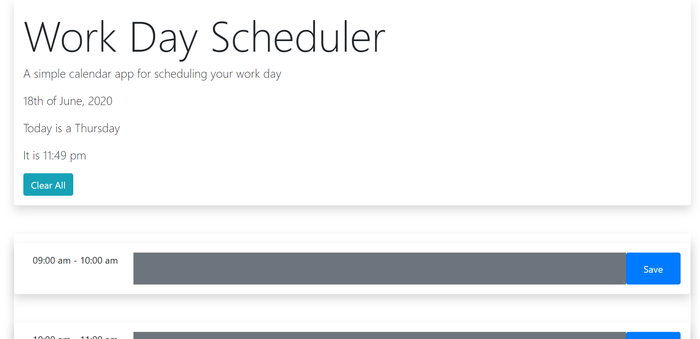

#  Work Day Scheduler

## Description

Hello and thank you for viewing my Work Day Scheduler(hourly planner)! The working site can be viewed here: https://wrxjasonsti.github.io/dailyPlanner/

The criteria provided for this activity included uses of local storage and DOM manipulation, but we were also made familiar with jQuery. jQuery makes it easier to visualize and realize ideas you are/were trying to do with Vanilla JS. It's very user friendly combined with the class-based format that Bootstrap uses. Styling-wise, I opted for a minimalist look choosing modern colors as well.

© 2020
